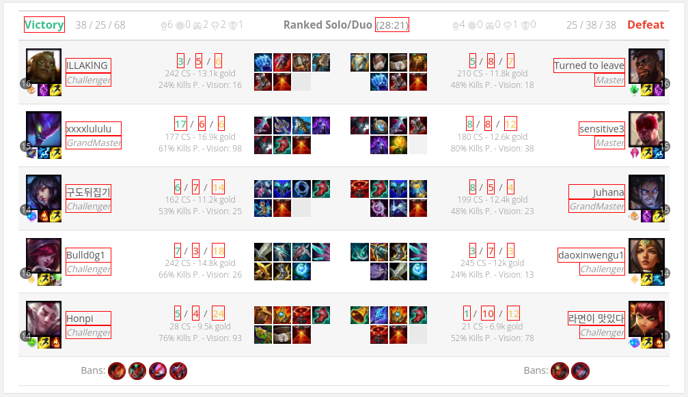

# mlscraper-rust

## Generate CSS selectors for web scraping automagically

This project is inspired by the python package [mlscraper](https://github.com/lorey/mlscraper),
which was insufficient for my use case.

## Example

This is a small example (the same as given by 
[mlscraper](https://github.com/lorey/mlscraper)) to demonstrate
how mlscraper-rust generates short CSS selectors automatically.

You can run this example by running `cargo run --release --example small`
in this directory.

All we have to do is to tell mlscraper-rust what values we expect
to extract from the web page...

```rust
    let html = reqwest::blocking::get("http://quotes.toscrape.com/author/Albert-Einstein/")
        .expect("request") // Scrappy error handling for demonstration purposes
        .text()
        .expect("text");

    let result = mlscraper_rust::train(
        vec![html.as_str()],
        vec![
            AttributeBuilder::new("name")
                .values(&[Some("Albert Einstein")])
                .build(),

            AttributeBuilder::new("born")
                .values(&[Some("March 14, 1879")])
                .build(),
        ],
        Default::default(),
        1
    ).expect("training");

    println!("{:?}", result.selectors());
```

... and it outputs the best (i.e. most concise) selectors it was able to find:

`{"born": .author-born-date, "name": h3}`

We can now use the trained `result` object to scrape similar pages:

```rust
    let html = reqwest::blocking::get("http://quotes.toscrape.com/author/J-K-Rowling")
        .expect("request")
        .text()
        .expect("text");

    let dom = result.parse(&html)
        .expect("parse");

    result.attributes()
        .for_each(|attr| {
            println!("{attr}: {:?}", result.get_value(&dom, attr).ok().flatten())
        })
```

This prints:

```
born: Some("July 31, 1965")
name: Some("J.K. Rowling")
```

As with the original mlscraper, mlscraper-rust unleashes its full potential
when providing *multiple* input files and *multiple* attribute values,
for example:

```rust
    // ------- 8< ---------------------
    // ... excerpt from examples/big.rs
    let result = train(
        // Multiple input documents
        htmls.iter().map(|s| s.as_ref()).collect(),
        vec![
            // We expect this value to be "Defeat" on the first page, "Victory" 
            // on the second, etc.
            AttributeBuilder::new("team0result")
                .values(&[Some("Defeat"), Some("Victory"), Some("Victory")])
                .build(),
    // ------------------- >8 ---------
```

mlscraper-rust will automatically generate CSS selectors
that work on *all* the input documents for all the provided values.

## Advantages over mlscraper (Python)

- **Better performance**: Instead of testing $O(2^n)$ possible selectors,
    we generate CSS selectors randomly and improve them iteratively
    using a basic genetic algorithm.
- **Smaller footprint**: mlscraper (Python) was killed by oomkiller on my
    machine while processing a 30kb HTML file. This version has no problems
    with many documents and attributes (although we could use some 
    Multithreading) -- see `examples/big.rs`.
- **Proper handling of missing data**: We allow values to be missing from
    some training examples and provide different strategies of
    handling these cases (see `MissingDataStrategy`).
- **Proper handling of duplicate data**: If a value is present multiple
    time, you can control which elements should be preferrably selected
    (see `MultipleMatchesStrategy`).
- **Filtering**: You can add custom filters and prioritization to control
    what kind of CSS selectors are generated!

### Performance Comparison

We compare `mlscraper` and `mlscraper_rust`'s performance on two Amazon 
product pages ([Apple iPhone](https://www.amazon.com/Apple-iPhone-11-64GB-Black/dp/B07ZPKN6YR),
[Samsung Galaxy](https://www.amazon.com/Samsung-Galaxy-S21-5G-Version/dp/B08VLMQ3KS)) which
have been downloaded to `python_comparison/{amazon_iphone, amazon_galaxy}.html`.

You can read the used benchmarking code in `python_comparison/amazon.py`
(original mlscraper python library) and `examples/amazon.rs` (ours).

We compare the time each method takes for "training", i.e., generating suitable
selectors. We use the average time of five runs.

Scraping Task              Time Original mlscraper      Time Ours (ms)       x    Selector Original    Selector Ours
-------------------------- ---------------------------- -------------------- ---- -------------------- -----------------------------------------
Extract product name       1771 ms                      25 ms                71x  #landingImage        #landingImage or #landingImage
Extract product price      1122 ms                      21 ms                53x  #base-product-price  #base-product-price
Name + price at once       6193 ms                      34 ms                182x as above             as above
Find "Add to Cart" button  ? (> 5 min)                  16 ms                -    -                    #comparison_add_to_cart_button3-announce


## Large-scale Example

All of these advantages are demonstrated in the large-scale example `big.rs`
that you can run using `cargo run --release --example big`.

It scrapes various match data from `leagueofgraphs.com`.

mlscraper-rust offers a function to highlight what elements have been
selected in the DOM with a red border. After letting the program run
for a bit, this is the output for the "big" example:



## Usage

In your project's `Cargo.toml`:

```toml
[dependencies]
mlscraper_rust = { git = "https://github.com/hilbigan/mlscraper-rust", branch = "main" }
```
